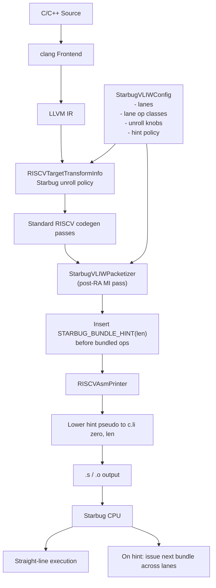

# Starbug Compiler Additions Diagram

## Main Added Components

- `llvm/lib/Target/RISCV/StarbugVLIWConfig.h`
- `llvm/lib/Target/RISCV/StarbugVLIWConfig.cpp`
- `llvm/lib/Target/RISCV/StarbugVLIWPacketizer.h`
- `llvm/lib/Target/RISCV/StarbugVLIWPacketizer.cpp`
- `llvm/lib/Target/RISCV/StarbugVLIWInstrInfo.td`

## Main Touched Components

- `llvm/lib/Target/RISCV/RISCVTargetTransformInfo.cpp`
- `llvm/lib/Target/RISCV/RISCVTargetMachine.cpp`
- `llvm/lib/Target/RISCV/RISCVAsmPrinter.cpp`
- `llvm/lib/Target/RISCV/RISCVFeatures.td`
- `llvm/lib/Target/RISCV/RISCVProcessors.td`
- `llvm/lib/Target/RISCV/RISCVInstrInfo.td`
